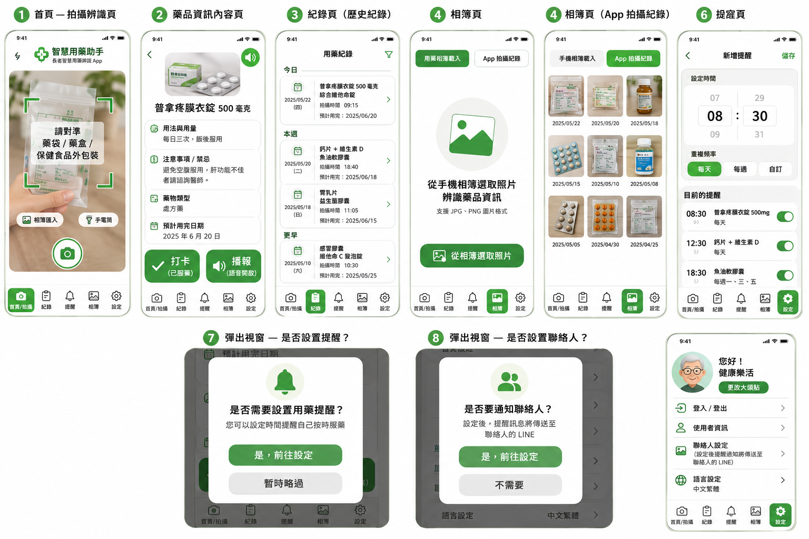

# 長者智慧用藥辨識平台 — 專案規格書

**版本：** V1.0  
**建立日期：** 2026-06-17  
**負責人：** 邱靖喻（PM / 系統架構師）  
**截止日期：** 2026-07-03  
**Firebase 專案：** elderly-medication-app-6b711  
**Git Repo：** github.com/kewpie1130-source/elderly-medication-helper

---

## 目錄

1. [專案目標](#一專案目標)
2. [系統架構](#二系統架構)
3. [UI 規範](#三ui-規範)
4. [UI 參考](#四ui-參考)
5. [頁面功能規格](#五頁面功能規格)
6. [資料格式定義](#六資料格式定義)
7. [技術規格](#七技術規格)
8. [API 介面定義](#八api-介面定義)
9. [專案資料夾規範](#九專案資料夾規範)
10. [分工表](#十分工表)
11. [Ownership 規則](#十一ownership-規則)
12. [Git 規範](#十二git-規範)
13. [禁止事項](#十三禁止事項)
14. [AI 開發指令規範](#十四ai-開發指令規範)

---

## 一、專案目標

開發一套專為長者設計的智慧用藥管理 App，結合 OCR 文字辨識與 AI 解析技術，協助長者正確識別藥品資訊、按時服藥，並透過 LINE 通知照護者，提升用藥安全與照護品質。

### 核心功能

- OCR 文字辨識（藥袋 / 藥盒 / 保健食品外包裝）
- Gemini AI 結構化解析與白話說明
- SQLite 本地儲存
- 用藥提醒（本地通知）
- 用藥打卡紀錄
- TTS 語音播報
- LINE 照護者通知
- 匿名健康趨勢分析 Dashboard

---

## 二、系統架構

### App 端流程

```
使用者拍攝藥袋 / 藥盒 / 保健食品外包裝
        ↓
ML Kit OCR 文字辨識
        ↓
Gemini 2.5 Flash 結構化解析
        ↓
SQLite 本地儲存
        ↓
藥品資訊頁面顯示
        ↓
建立用藥提醒（可選）
        ↓
打卡記錄服藥
        ↓
TTS 語音播報（可開關）
        ↓
LINE 通知照護者（可選）
```

### Dashboard 端流程

```
App 端匿名資料蒐集
        ↓
上傳至 Firebase Firestore
        ↓
Dashboard 管理介面
        ↓
圖表統計分析
        ↓
趨勢報表輸出
```

### 模組關係圖

```
┌─────────────────────────────────────────────┐
│                   App 端                     │
│                                             │
│  camera_page                                │
│      ↓                                      │
│  ocr_service ──→ gemini_service             │
│      ↓                   ↓                  │
│  medicine_model ←─────────                  │
│      ↓                                      │
│  database_helper (SQLite)                   │
│      ↓              ↓             ↓         │
│  medicine_page  history_page  reminder_page │
│                      ↓             ↓        │
│               dose_log_model  notification  │
│                                    ↓        │
│                              tts_service    │
│                              line_service   │
└─────────────────────────────────────────────┘
        ↓ 匿名資料
┌─────────────────────────────────────────────┐
│              Firebase / Dashboard            │
│                                             │
│  analytics_service → Firestore → Dashboard  │
└─────────────────────────────────────────────┘
```

---

## 三、UI 規範

### 配色

| 用途 | 色碼 |
|------|------|
| 主色 | `#4CAF50`（草綠） |
| 輔助色 | `#81C784`（淺綠） |
| 背景 | `#FFFFFF`（白） |
| 文字 | `#222222`（深灰近黑） |
| 錯誤 | `#F44336`（紅） |
| 警告 | `#FF9800`（橘） |

### 字體大小

| 用途 | 大小 |
|------|------|
| 頁面標題 | 24px 以上 |
| 區塊標題 | 20px 以上 |
| 內文 | 16～18px |
| 按鈕文字 | 18px 以上 |

### 元件規範

| 元件 | 規格 |
|------|------|
| 卡片圓角 | 20px |
| 卡片陰影 | elevation 3 |
| 按鈕最小高度 | 56px（長者易點擊） |
| 卡片背景 | 白色 |

### 長者友善原則

- 大字體、高對比
- 大按鈕、易點擊
- 圖示搭配文字標籤
- 避免複雜多步驟操作
- 重要操作需二次確認

---

## 四、UI 參考

### 參考圖檔



### 使用規則

- UI 實作以 `assets/design/ui_reference.png` 作為主要視覺參考。
- 配色、卡片圓角、按鈕大小與字體層級需優先符合「三、UI 規範」。
- 頁面排版應維持長者友善：資訊分區清楚、主要操作明顯、避免過多同層級按鈕。
- 若實作頁面與參考圖不同，需在 PR 說明差異原因與影響範圍。

---

## 五、頁面功能規格

### 頁面1：首頁 — 相機拍攝辨識頁（邱靖喻）

**路徑：** `lib/pages/camera/camera_page.dart`

**功能說明：**
- 相機取景器畫面，中央顯示矩形掃描框
- 掃描框四角有綠色 L 型標記
- 提示文字：「請對準藥袋 / 藥盒 / 保健食品」
- 拍攝按鈕（大圓形綠色）
- 相簿選取按鈕
- 辨識中顯示 Loading 動畫

**流程：**
```
拍攝 / 選取圖片
      ↓
OcrService.recognizeText()
      ↓
GeminiService.parseOcrResult()
      ↓
導向藥品資訊頁（傳入 MedicineModel）
      ↓
若為第一次辨識此藥品 → 跳出提醒 Modal（頁面7）
```

**錯誤處理：**
- OCR 失敗 → SnackBar 顯示錯誤訊息
- Gemini 解析失敗 → SnackBar 顯示錯誤訊息
- 相機權限未授權 → 引導至設定頁

---

### 頁面2：藥品資訊頁（組員A）

**路徑：** `lib/pages/medicine/medicine_detail_page.dart`

**功能說明：**
- 顯示辨識結果的藥品資訊
- 不顯示個人資訊（姓名、醫院、診所）
- 資訊欄位：
  - 藥品名稱
  - 類型（處方藥 / 指示藥 / 保健食品）
  - 用法與用量
  - 服用頻率
  - 服用時間
  - 注意事項 / 禁忌
  - 適應症（indication）
  - 開始日期
  - 預計用完日期
- 底部按鈕：
  - ✅ 打卡（已服藥）→ 建立 DoseLog 紀錄
  - 🔊 播報（開關 TTS 語音）

**接收參數：** `MedicineModel medicine`

---

### 頁面3：歷史紀錄頁（組員A）

**路徑：** `lib/pages/history/history_page.dart`

**功能說明：**
- 以時間軸或卡片列表顯示歷史辨識紀錄
- 依日期分組（今日 / 本週 / 更早）
- 每筆紀錄顯示：
  - 日期（年月日）
  - 藥品或保健食品名稱
  - 辨識時間
  - 藥單預計結束日期
- 點擊紀錄可進入詳細頁

---

### 頁面4：相簿頁（組員C）

**路徑：** `lib/pages/gallery/gallery_page.dart`

**功能說明：**
- 頂部兩個 Tab 切換：
  - 「手機相簿載入」：選取手機相簿圖片進行辨識
  - 「App 拍攝紀錄」：顯示 App 內拍攝的藥品照片
- 「App 拍攝紀錄」Tab：
  - 網格（grid）方式顯示縮圖
  - 照片下方顯示拍攝日期
- 選取照片後進入辨識流程

---

### 頁面5：提醒頁（組員B）

**路徑：** `lib/pages/reminder/reminder_page.dart`

**功能說明：**
- 上半部：新增提醒設定
  - 時間選擇（時 / 分）
  - 重複頻率（每天 / 每週 / 自訂）
  - 對應藥品選擇
- 下半部：已設定提醒清單
  - 顯示時間、藥品名稱、重複設定
  - 右側開關 Toggle（單獨開關）
  - 可編輯 / 刪除

---

### 頁面6：設定頁（組員C）

**路徑：** `lib/pages/settings/settings_page.dart`

**功能說明：**
- 使用者大頭貼 + 名稱
- 設定清單：
  - 登入 / 登出
  - 使用者資訊編輯
  - 大頭貼更改
  - 聯絡人設定（設定後提醒傳送至聯絡人 LINE）
  - 語言設定（繁體中文 / English）
- 每個項目右側有箭頭「>」

---

### 頁面7：是否設置提醒 Modal（組員B）

**觸發時機：** 第一次辨識藥品 / 保健食品後

**功能說明：**
- 半透明遮罩背景
- 圓角白色彈出視窗
- 標題：「是否需要設置用藥提醒？」
- 副文字：「您可以設定時間提醒自己按時服藥」
- 按鈕：
  - 「是，前往設定」（綠色）→ 導向提醒頁（頁面5）
  - 「暫時略過」（灰色）→ 關閉 Modal

---

### 頁面8：是否設置聯絡人 Modal（組員B）

**觸發時機：** 設定提醒完成後

**功能說明：**
- 半透明遮罩背景
- 圓角白色彈出視窗
- 標題：「是否要通知聯絡人？」
- 副文字：「設定後，提醒訊息將傳送至聯絡人的 LINE」
- 按鈕：
  - 「是，前往設定」（綠色）→ 導向設定頁聯絡人區塊
  - 「不需要」（灰色）→ 關閉 Modal

---

## 六、資料格式定義

> ⚠️ 以下格式由邱靖喻統一定義，禁止自行修改欄位。需新增欄位請先找邱靖喻確認。

### MedicineModel

```json
{
  "id": "uuid-string",
  "name": "藥品名稱",
  "type": "處方藥 | 指示藥 | 保健食品",
  "dosage": "每次劑量（如：1顆）",
  "frequency": "服用頻率（如：每日三次）",
  "timing": ["早餐後", "午餐後", "晚餐後"],
  "notice": "注意事項或禁忌",
  "indication": "適應症（白話說明此藥用於治療什麼症狀）",
  "startDate": "2026-06-17",
  "endDate": "2026-06-30",
  "imagePath": "本地圖片路徑",
  "createdAt": "2026-06-17T10:00:00.000Z"
}
```

### ReminderModel

```json
{
  "id": "uuid-string",
  "medicineId": "對應 MedicineModel 的 id",
  "time": "08:00",
  "repeatType": "daily | weekly | custom",
  "enabled": true
}
```

### DoseLogModel

```json
{
  "id": "uuid-string",
  "medicineId": "對應 MedicineModel 的 id",
  "scheduledTime": "2026-06-17T08:00:00.000Z",
  "takenTime": "2026-06-17T08:05:00.000Z",
  "status": "taken | missed | skipped",
  "createdAt": "2026-06-17T08:05:00.000Z"
}
```

### Dashboard Analytics（匿名）

```json
{
  "age_group": "65-74 | 75-84 | 85+",
  "gender": "male | female | other",
  "medicine_type": "處方藥 | 指示藥 | 保健食品",
  "taken": true,
  "hour": "08"
}
```

---

## 七、技術規格

### 核心技術

| 功能 | 技術 / 套件 |
|------|------------|
| UI 框架 | Flutter 3.44.1 |
| OCR 辨識 | google_mlkit_text_recognition |
| AI 解析 | Gemini 2.5 Flash API |
| 本地資料庫 | sqflite（SQLite） |
| 本地通知 | flutter_local_notifications |
| 語音播報 | flutter_tts |
| 照護者通知 | LINE Messaging API |
| 圖片選取 | image_picker |
| Dashboard 資料庫 | Firebase Firestore |
| 唯一 ID 產生 | uuid |
| HTTP 請求 | http |

### pubspec.yaml 套件清單

```yaml
dependencies:
  flutter:
    sdk: flutter
  
  # 圖片選取
  image_picker: ^1.1.2
  
  # OCR
  google_mlkit_text_recognition: ^0.13.0
  
  # AI 解析
  http: ^1.2.0
  
  # 本地資料庫
  sqflite: ^2.3.0
  path_provider: ^2.1.0
  
  # 通知
  flutter_local_notifications: ^17.0.0
  
  # 語音
  flutter_tts: ^4.0.0
  
  # Firebase
  firebase_core: ^3.0.0
  cloud_firestore: ^5.0.0
  
  # 工具
  uuid: ^4.4.0
```

### Gemini API 規格

- **模型：** gemini-2.5-flash
- **端點：** `https://generativelanguage.googleapis.com/v1beta/models/gemini-2.5-flash:generateContent`
- **API Key 管理：** `--dart-define=GEMINI_API_KEY=your_key`
- **執行方式：** `flutter run --dart-define=GEMINI_API_KEY=你的Key`

### SQLite Schema

```sql
-- 藥品表
CREATE TABLE medicines (
  id TEXT PRIMARY KEY,
  name TEXT NOT NULL,
  type TEXT,
  dosage TEXT,
  frequency TEXT,
  timing TEXT,  -- JSON array string
  notice TEXT,
  startDate TEXT,
  endDate TEXT,
  imagePath TEXT,
  createdAt TEXT NOT NULL
);

-- 提醒表
CREATE TABLE reminders (
  id TEXT PRIMARY KEY,
  medicineId TEXT NOT NULL,
  time TEXT NOT NULL,
  repeatType TEXT NOT NULL,
  enabled INTEGER NOT NULL DEFAULT 1,
  FOREIGN KEY (medicineId) REFERENCES medicines(id)
);

-- 服藥紀錄表
CREATE TABLE dose_logs (
  id TEXT PRIMARY KEY,
  medicineId TEXT NOT NULL,
  scheduledTime TEXT NOT NULL,
  takenTime TEXT,
  status TEXT NOT NULL,
  createdAt TEXT NOT NULL,
  FOREIGN KEY (medicineId) REFERENCES medicines(id)
);
```

### Android 權限（AndroidManifest.xml）

```xml
<uses-permission android:name="android.permission.INTERNET"/>
<uses-permission android:name="android.permission.CAMERA"/>
<uses-permission android:name="android.permission.READ_EXTERNAL_STORAGE"
  android:maxSdkVersion="32"/>
<uses-permission android:name="android.permission.READ_MEDIA_IMAGES"/>
<uses-feature android:name="android.hardware.camera" android:required="false"/>
```

---

## 八、API 介面定義

### OcrService

```dart
class OcrService {
  // 辨識圖片中的文字
  Future<String> recognizeText(XFile imageFile) async
  // 回傳：辨識出的文字字串，失敗回傳空字串
}
```

### GeminiService

```dart
class GeminiService {
  // 將 OCR 文字解析為 MedicineModel
  Future<MedicineModel> parseOcrResult(String ocrText) async
  // 回傳：MedicineModel，失敗拋出 Exception
}
```

### 頁面間傳遞參數規範

| 來源頁面 | 目標頁面 | 傳遞參數 |
|---------|---------|---------|
| camera_page | medicine_detail_page | `MedicineModel medicine` |
| medicine_detail_page | reminder_page | `String medicineId` |
| reminder_page | settings_page | 無（導向聯絡人區塊） |

---

## 九、專案資料夾規範

```
lib/
├── theme/
│   └── app_theme.dart          # [邱靖喻] 全組統一主題
├── widgets/
│   └── common_widgets.dart     # [邱靖喻] 全組共用元件
├── navigation/
│   └── app_router.dart         # [邱靖喻] 全組統一導覽
├── models/
│   ├── medicine_model.dart     # [邱靖喻] 統一資料格式
│   ├── reminder_model.dart     # [邱靖喻] 統一資料格式
│   └── dose_log_model.dart     # [邱靖喻] 統一資料格式
├── pages/
│   ├── camera/
│   │   └── camera_page.dart    # [邱靖喻]
│   ├── medicine/               # [組員A]
│   ├── history/                # [組員A]
│   ├── reminder/               # [組員B]
│   ├── gallery/                # [組員C]
│   └── settings/               # [組員C]
├── services/
│   ├── ocr/
│   │   └── ocr_service.dart    # [邱靖喻]
│   ├── gemini/
│   │   └── gemini_service.dart # [邱靖喻]
│   ├── notification/           # [組員B]
│   ├── tts/                    # [組員B]
│   ├── line/                   # [組員B]
│   └── analytics/              # [組員C]
├── database/                   # [組員A]
├── repositories/               # [組員A]
├── firebase/                   # [組員C]
└── main.dart                   # [邱靖喻] 最小修改
```

---

## 十、分工表

### 邱靖喻（PM / 系統架構師 / OCR負責人）

| 負責項目 | 說明 |
|---------|------|
| 頁面1 | 首頁相機拍攝辨識頁 |
| theme/ | 全組統一主題 |
| widgets/ | 全組共用元件 |
| navigation/ | 全組統一導覽 |
| models/ | 全組統一資料格式 |
| services/ocr/ | ML Kit OCR 封裝 |
| services/gemini/ | Gemini API 封裝 |
| main.dart | 最小修改 |
| Git 管理 | PR 審核、分支管理 |
| 功能整合 | 最終整合者 |

### 組員A（藥品管理 / SQLite模組）

| 負責項目 | 說明 |
|---------|------|
| 頁面2 | 藥品資訊頁 |
| 頁面3 | 歷史紀錄頁 |
| database/ | SQLite 資料庫 |
| repositories/ | 資料存取層 |
| 打卡功能 | DoseLog 建立 |

### 組員B（提醒 / 通知 / LINE）

| 負責項目 | 說明 |
|---------|------|
| 頁面5 | 提醒頁 |
| 頁面7 | 提醒 Modal |
| 頁面8 | 聯絡人 Modal |
| services/notification/ | 本地通知 |
| services/tts/ | 語音播報 |
| services/line/ | LINE 通知 |

### 組員C（設定 / 相簿 / Dashboard）

| 負責項目 | 說明 |
|---------|------|
| 頁面4 | 相簿頁 |
| 頁面6 | 設定頁 |
| firebase/ | Firebase 串接 |
| analytics/ | 匿名資料收集 |
| Dashboard | 管理介面、圖表分析 |

---

## 十一、Ownership 規則

> ⚠️ 這是最重要的規則，違反將導致 Git 衝突與功能互蓋。

| 資料夾 / 檔案 | 負責人 | 其他人是否可修改 |
|-------------|--------|----------------|
| `theme/` | 邱靖喻 | ❌ 禁止 |
| `widgets/` | 邱靖喻 | ❌ 禁止（可新增，不可刪改） |
| `navigation/` | 邱靖喻 | ❌ 禁止 |
| `models/` | 邱靖喻 | ❌ 禁止 |
| `main.dart` | 邱靖喻 | ❌ 禁止 |
| `pubspec.yaml` | 邱靖喻 | ❌ 禁止（需求請找邱靖喻） |
| `database/` | 組員A | ❌ 禁止 |
| `repositories/` | 組員A | ❌ 禁止 |
| `pages/medicine/` | 組員A | ❌ 禁止 |
| `pages/history/` | 組員A | ❌ 禁止 |
| `pages/reminder/` | 組員B | ❌ 禁止 |
| `services/notification/` | 組員B | ❌ 禁止 |
| `services/tts/` | 組員B | ❌ 禁止 |
| `services/line/` | 組員B | ❌ 禁止 |
| `pages/gallery/` | 組員C | ❌ 禁止 |
| `pages/settings/` | 組員C | ❌ 禁止 |
| `firebase/` | 組員C | ❌ 禁止 |
| `analytics/` | 組員C | ❌ 禁止 |

---

## 十二、Git 規範

### 分支結構

```
main                    # 正式版本
  └── develop           # 整合分支
        ├── feature/a-ocr-camera      # 邱靖喻
        ├── feature/member-a          # 組員A
        ├── feature/member-b          # 組員B
        └── feature/member-c          # 組員C
```

### 開發流程

```
1. 在自己的 feature branch 開發
2. 完成後開 PR → develop
3. 邱靖喻審核
4. 通過後 merge 進 develop
5. 測試穩定後 merge 進 main
```

### Commit 格式

```
feat: [負責人] 功能描述
fix: [負責人] 修正描述
chore: [負責人] 雜項描述

範例：
feat: [邱靖喻] 完成 OCR 辨識流程
fix: [組員A] 修正藥品頁面顯示錯誤
```

---

## 十三、禁止事項

以下檔案禁止自行修改（需修改請找邱靖喻）：

- `main.dart`
- `pubspec.yaml`
- `lib/models/` 所有檔案
- `lib/theme/app_theme.dart`
- `lib/navigation/app_router.dart`
- `database schema`（SQLite 表結構）

### 嚴禁的行為

- ❌ 跨區修改（修改不屬於自己的資料夾）
- ❌ 直接 push 到 develop 或 main
- ❌ 不開 PR 直接 merge
- ❌ 在 pubspec.yaml 自行新增套件
- ❌ 修改 Models 欄位
- ❌ 把 API Key commit 進 Git

---

## 十四、AI 開發指令規範

使用 Claude / Codex 等 AI 工具時，每次對話請貼上以下指令：

```
你正在協助開發 Flutter 專題：長者智慧用藥辨識 App

請遵守以下規則：
1. 只能修改我負責的資料夾（見下方分工表）
2. 不可修改 main.dart
3. 不可修改 pubspec.yaml
4. 不可修改 models/ 任何檔案
5. 不可修改其他組員的資料夾
6. UI 風格統一：
   - 主色 #4CAF50
   - 背景白色
   - 圓角卡片（radius 20）
   - 大字體（內文最小 16px）
   - 長者友善設計
7. 修改前先列出準備修改的檔案
8. 修改後列出：
   - 修改了哪些檔案
   - 完成哪些功能
   - 如何測試
   - 是否影響其他模組
9. 不要重構整個專案
10. 若需修改共用檔案，先停止並告知我
```

---

## 附錄：常見問題

### Q：需要新增套件怎麼辦？
A：告知邱靖喻，由邱靖喻統一修改 pubspec.yaml。

### Q：需要新增 Model 欄位怎麼辦？
A：告知邱靖喻，由邱靖喻統一修改 models/。

### Q：需要修改 navigation 新增頁面？
A：告知邱靖喻，由邱靖喻更新 app_router.dart 把 Placeholder 換成你的頁面。

### Q：執行方式？
```bash
# 一般執行
flutter run

# 含 Gemini API Key 執行
flutter run --dart-define=GEMINI_API_KEY=你的真實Key

# 建置 APK
flutter build apk --dart-define=GEMINI_API_KEY=你的真實Key
```

---

*本規格書由邱靖喻建立並維護，修改前請知會 PM。*  
*最後更新：2026-06-17*
